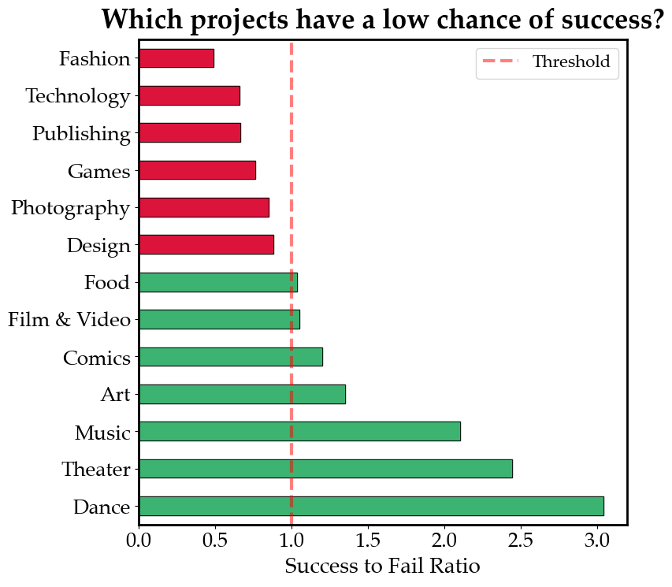

# Kickstarter Machine Learning Project

<div align="center">
    
</div>

---

## 📈 Key Insights

Projects in the **Dance**, **Music**, and **Theater** categories tend to have the **highest success rates** on Kickstarter.

- These categories consistently attract **more backers**.
- They also secure **higher median funding** compared to others.
- Launching a project in any of these categories is statistically more favorable.



---

## 🤖 Predicting Pledge Amount with Machine Learning

A machine learning model was built to predict how much a Kickstarter project is likely to raise in pledges.

### **Model Objective**  
Predict the pledged amount based on key project attributes.

### **Selected Features**

```python
features = ['subcategory', 'location', 'goal', 'backers', 'updates_per_day']
target = 'pledged'
```

### **Algorithm Used**  
`RandomForestRegressor`
- Chosen for its robustness and ability to handle both numerical and categorical features.
- Achieved an **R² score of 0.76**, meaning the model explains approximately **76.45% of the variance** in the pledged amount.
